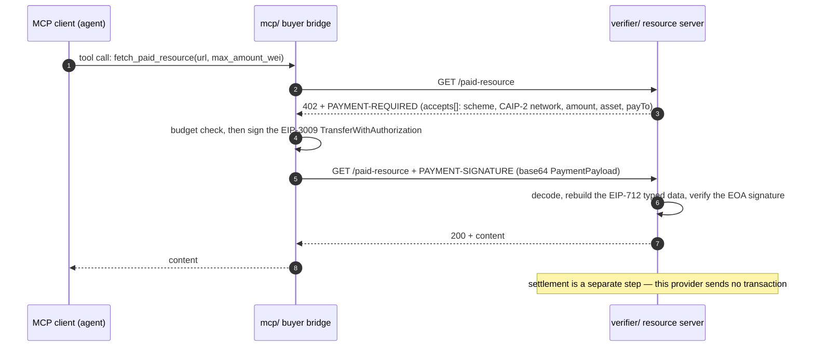

# x402-agent-payments

[](https://github.com/Wisely0710/x402-agent-payments/actions/workflows/ci.yml)

An [x402](https://docs.x402.org) **v2** payment stack for EVM networks: verify payments on the server, sign them in the browser, and let an AI agent pay for a resource over MCP.

The whole flow runs on localhost with no chain, no facilitator and no real key — `scripts/demo.sh` starts a seller built on the real verifier and pays it from the agent side: **402 → signed authorization → 200**.

## Components

| Component | Language | What it does |
|---|---|---|
| [`verifier/`](verifier/) | Python | Server side: builds the 402 challenge (`PAYMENT-REQUIRED`) and verifies `PAYMENT-SIGNATURE` (official x402 SDK, EIP-712 / EIP-3009). 33 tests. |
| [`client/`](client/) | TypeScript | Browser side: 402 → EIP-3009 authorization signed by the injected wallet → retry with `PAYMENT-SIGNATURE`. No runtime dependencies. |
| [`mcp/`](mcp/) | Python | Agent side: an MCP server that buys x402-protected resources on the agent's behalf, plus the paying client the demo uses. 6 tests. |

## How it fits together



The browser path is the same handshake from the other side: [`client/`](client/) talks to a server that runs [`verifier/`](verifier/).

## Quickstart

### 1. Run the paid flow (about 30 seconds)

```bash
git clone git@github.com:Wisely0710/x402-agent-payments.git
cd x402-agent-payments
scripts/demo.sh
```

The first run creates `.demo/venv` with just the x402 SDK and eth-account (no MCP SDK, no chain). Real output:

```text
[ agent] GET http://127.0.0.1:50695/paid-resource (budget 1000 atomic units)
[seller] request without PAYMENT-SIGNATURE → 402
[seller]   accepts[0]: scheme=exact network=eip155:31337 amount=100 asset=0x33333333…
[ agent]   signing EIP-712 TransferWithAuthorization value=100 to=0x44444444… chainId=31337
[seller] retry with PAYMENT-SIGNATURE → verifying (x402_v2.provider)
[seller]   verified payer=0x1563915e194D8CfBA1943570603F7606A3115508 amount=100 network=eip155:31337
[seller]   settlement is out of scope here — no transaction is sent
[ agent] received: {"status": "paid", "data": "premium data"}
[  demo] 402 → signed authorization → 200, in-process and chain-free
```

### 2. verifier — Python 3.11+

```bash
cd verifier
python3.11 -m venv .venv
.venv/bin/pip install -e ".[dev]"
.venv/bin/python -m pytest -q          # 33 tests
.venv/bin/ruff check .                 # lint + format are the same gates CI runs
.venv/bin/mypy
```

### 3. client — TypeScript

```bash
cd client
yarn install
yarn lint          # biome
yarn check-types   # tsc --noEmit
yarn build
```

### 4. mcp — Python 3.11+

```bash
cd mcp
python3.11 -m venv .venv
.venv/bin/pip install -e ".[dev]"
.venv/bin/python -m pytest -q          # 6 tests, no chain
X402_AGENT_PRIVATE_KEY=0x... .venv/bin/python -m x402_mcp.server   # MCP server mode (stdio)
```

## Scope and non-goals

This stack is **verification-only**. It does not custody keys, does not call a facilitator and does not send transactions; settlement stays with the resource owner (the payer wallet calls the resource contract, or a facilitator settles the same signed authorization where the token supports EIP-3009).

Wire coverage: x402 v2 HTTP (`PAYMENT-REQUIRED`, `PAYMENT-SIGNATURE`), `exact` scheme, CAIP-2 `eip155:*` networks. x402 **v1** payloads are rejected explicitly rather than half-accepted.

## Design notes

- **Official SDK first.** Header names, codecs, EIP-712 typed data and payload models come from the [`x402`](https://pypi.org/project/x402/) package; only policy (which `accepts[]` entry to take, the budget rule, key management) is application code. Hand-rolling the wire format only adds drift.
- **Fail closed.** Unknown networks, mismatched requirements, missing token metadata and v1 payloads all raise instead of degrading.
- **Stateless verification.** Signatures are re-verified with real crypto on every request — no signature/nonce cache that a changed `from` could hit.
- **Thin boundary.** Application code never sees SDK types: the verifier hands back a plain `VerifiedPayment` DTO.

## Development

```bash
scripts/install-hooks.sh   # core.hooksPath -> .githooks (pre-commit secret scan)
scripts/check-secrets.sh   # the same scan over all tracked files
```

CI runs the gates documented above per component — `ruff` (lint + format), `mypy`, `pytest` for the two Python packages; `biome`, `tsc`, `build` for the client; the secret scan; and the demo end to end.

## Status

Early, but the core loop is real and covered: 39 tests plus an end-to-end demo that runs in CI. The TypeScript client is type-checked and built in CI but has no automated test suite yet, and only the `exact` scheme on EVM is implemented.

## License

MIT — see [LICENSE](LICENSE).
